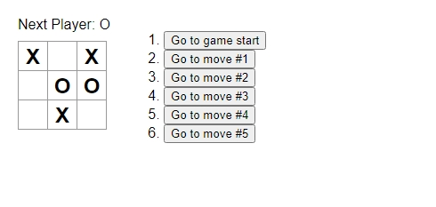

# Tic-Tac-Toe tutorial from React docs

This is the introductory tutorial project on React documentation.  

### The challenge

Users should be able to:

- Play the tic-tac-toe game by taking turns
- See the history of the game by clicking the button for a certain move

### Screenshot

### Links

- [View Code](https://github.com/elizerdim/react-tic-tac-toe)
- [Live Preview](https://react-tic-tac-toe-sage-psi.vercel.app/)

### Built with

- HTML
- React

### What I learned

I followed along with the tutorial on React documentation to create this project locally and understand React better. I already knew the syntax, useState hook, rendering methods, and the principle of immutability in React, but I learned when and how state should be lifted and how useState can be used to save history and render a point that history. I already feel more comfortable using React and I plan to finish reading the documentation along with doing all the exercises to gain a deeper understanding of React.

### Useful resources

- [React docs](https://react.dev/) - Documentation is the best place to learn a library or framework.